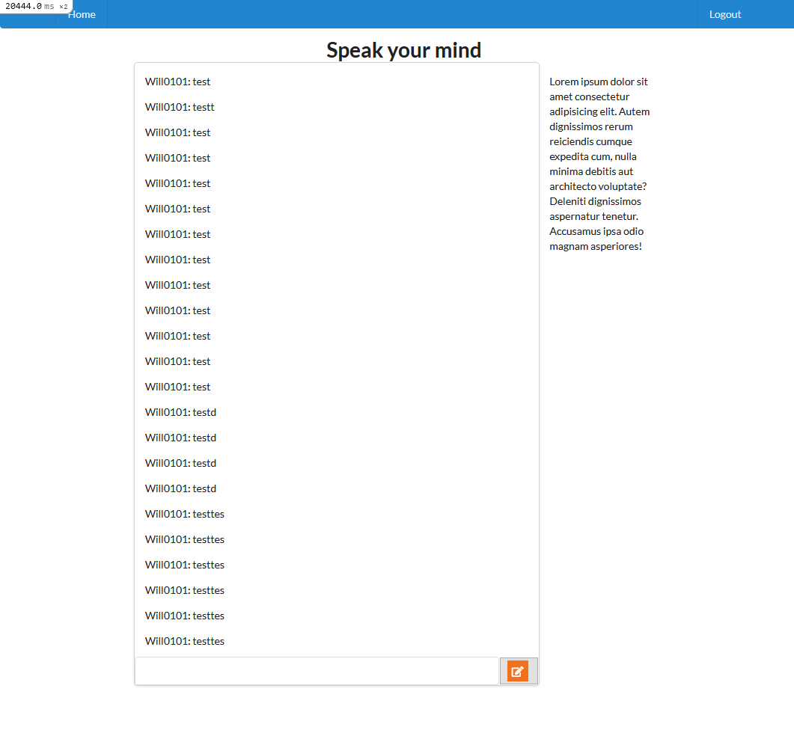
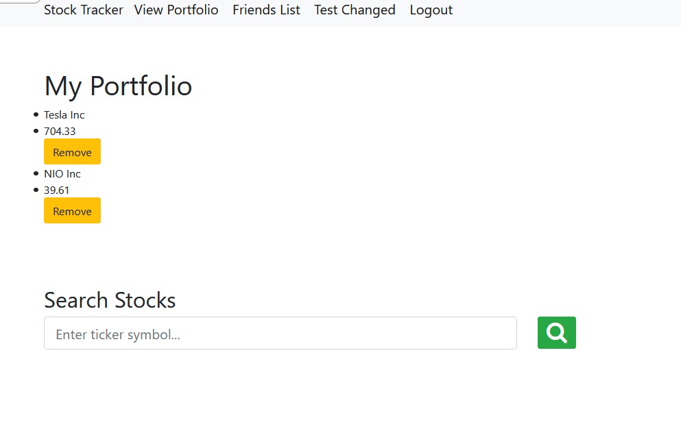

# Learning Ruby On Rails

This holds all the work I did for this Ruby on Rails course I did. Nothing much to see here (:

Please note, the goal of this is to not make them look "pretty" but to have them work.

## Resources Used

1. https://www.udemy.com/course/the-complete-ruby-on-rails-developer-course/
2. https://github.com/rubocop/ruby-style-guide

## How to run locally

1. You need to have [rails](https://rubyonrails.org/) installed on your system.
2. Once the project is installed locally run `rails server`

## End Result

### Rant
I can see where RoR would/could be useful in building web applications. But, Rails isn't a thing you can just hop into and hit the ground running unless you're OK with a lot of abstraction. A depth of Ruby fundamentals are required to know how something like `root "welcome#index` is even working. I'm writing this on `May 3, 2021`. VSCode is the go-to IDE their support for the Javascript eco-system is great. There's autocomplete and linting baked into VSCode for JS. Why would I, a fresh new developer just starting out in their career gravitate towards the Rails eco-system when it's clear that the support for Rails isn't quite there in the tools I know and love? 

### TLDR
Rails is something that I would only work with if I was paid to do it. Not for fun. 

## [1. Blog Project](https://wb-hello-world-blog.herokuapp.com/)

### Subjects learnt

- Created a functioning Rails application.
- How to CRUD a resource (articles).
- Deployed a Rails app to Heroku.
- Conditional rendering with embedded Ruby.
- Creating partials.
- Authentication, (without the devise gem). (This includes user permissions on the view and controller level)
- Please note, there is no exception handling in the applation meaning. For example, trying to log in with the wrong information will render a pre-built Rail's HTML page
- Unit/Integration testing. (Testing controllers and models)
- Creating one-to-one and many-to-many table relationships.

## [2. Chat Application](https://wb-chat-app.herokuapp.com/)

### Subjects learnt

- Working with the Semantic-UI gem
- Adding a favicon
- ActionCable(WebSocket) connections

## [3. Social Media Stock Tracker](https://protected-headland-15811.herokuapp.com/)

- Note, had trouble with the API in production used to get stock data in this one. It works on and off.

### Subjects learnt

- The devise gem for authentication
- How to store sensitive info in Rails
- Using Ajax for form submission
- Self referential association for friendship feature
- Customizing the views for devise using Bootstrap
- Rendering JS partials
