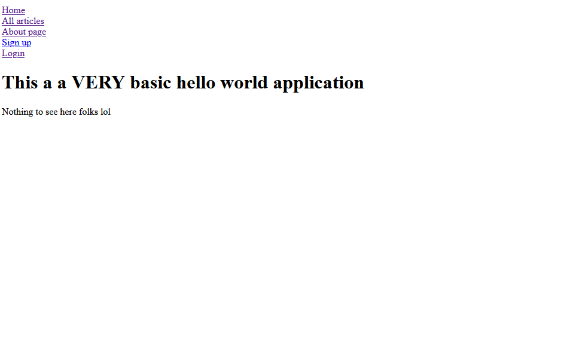

# Learning Ruby On Rails

This holds all the work I did for this Ruby on Rails course I did. Nothing much to see here (:

Please note, the goal of this is to not make them look "pretty" but to have them work.

## Resources Used

1. https://www.udemy.com/course/the-complete-ruby-on-rails-developer-course/
2. https://github.com/rubocop/ruby-style-guide

## How to run locally

1. You need to have [rails](https://rubyonrails.org/) installed on your system.
2. Once the project is installed locally run `rails server`

## End Result - Not done yet.

1. https://wb-hello-world-blog.herokuapp.com/

### Subjects learnt

- Created a functioning Rails application.
- How to CRUD a resource (articles).
- Deployed a Rails app to Heroku.
- Conditional rendering with embedded Ruby.
- Creating partials.
- Authentication, (without the devise gem). (This includes user permissions on the view and controller level)
- Please note, there is no exception handling in the applation meaning. For example, trying to log in with the wrong information will render a pre-built Rail's HTML page
- Unit/Integration testing. (Testing controllers and models)
